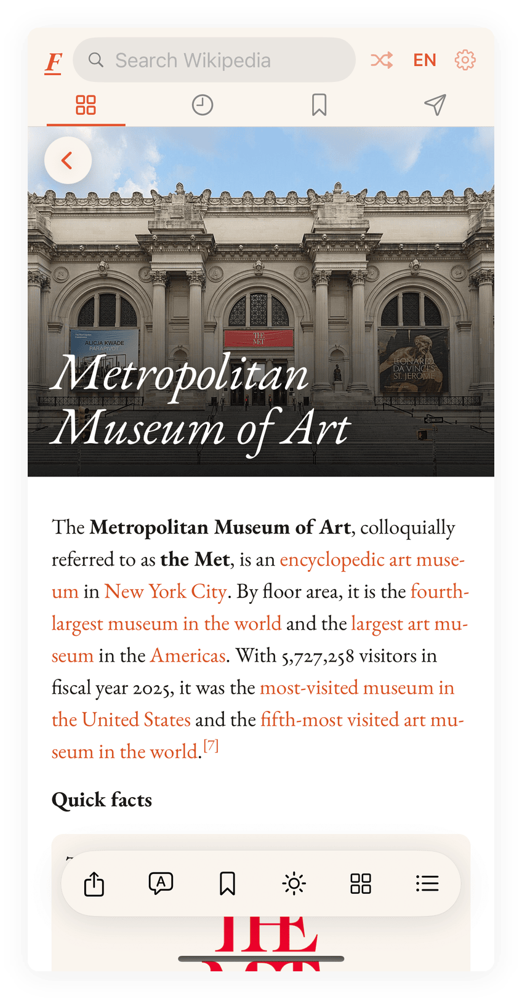
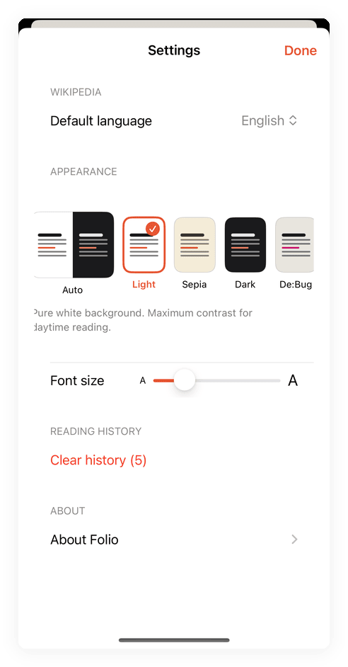
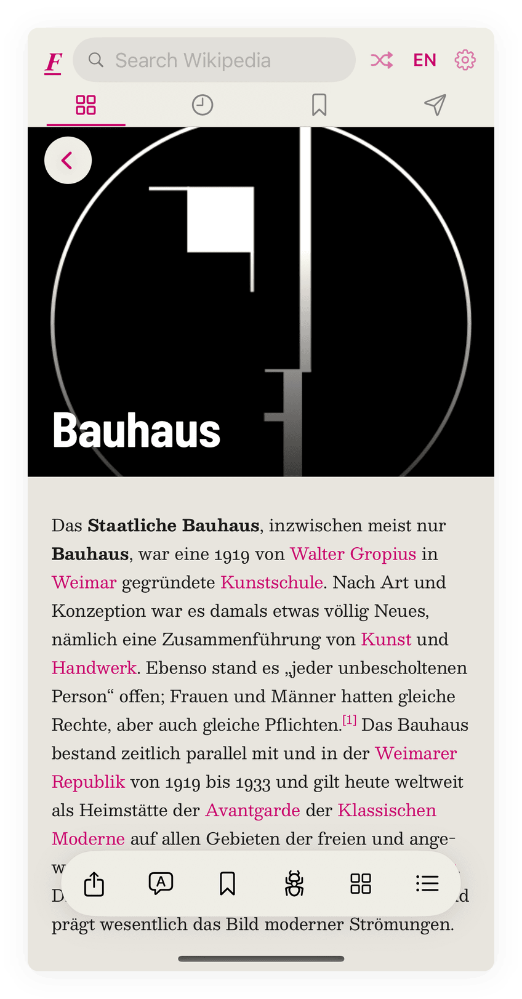

# Folio

V for Wikipedia by Frank Rausch was the nicest way to
read Wikipedia on a phone. It was discontinued and pulled from the App Store
in August 2022. I kept using my copy anyway, until Wikipedia changed
something in their APIs and the Today view went blank. So I built Folio: a
personal recreation of the parts I used every day. It is an homage, not a replacement. The original's polish took years. This took a few evenings, and it shows in places.

<p align="center">
  
</p>

<p align="center">
  
  
  
</p>

<p align="center"><sub>Today, Nearby, Settings</sub></p>

<p align="center">
  
</p>

<p align="center"><sub>The De:Bug theme, which swaps the prose face as well as the palette</sub></p>

## What it does

- Today: Wikipedia's featured article, most-read, and news as a photo grid with
  stable crops that do not reposition after appearing
- Reader: EB Garamond at a capped reading measure, locale-aware typography and
  hyphenation, on-device face-aware hero crops, light, sepia and dark themes
  plus a De:Bug tribute theme that swaps the prose face too, pinch
  to change text size, table of contents, and image gallery. A lead image
  promoted to the hero is not repeated in the article body, and any image
  opens full screen with its caption, the hero included.
- Nearby: Wikipedia articles around you, on a map
- Search, bookmarks, and reading history, stored locally with SwiftData
- English and German Wikipedia, toggled from the header
- Articles and images are cached and prefetched, so most things open instantly

There is no backend, no analytics, and no accounts. The app talks directly to
Wikipedia's public APIs and nothing else. Nearby sends your coordinates to
Wikipedia's geosearch endpoint and nowhere further.

## Typography

The type follows the reading situation. Today and Nearby are scanning
surfaces, so titles there use EB Garamond Medium, italic on the grid, and
each Today tile darkens its image only as much as that image's measured
brightness requires. The reader sets 18px at 1.52 line height, sized by
x-height rather than by the nominal number, with the measure capped at 26rem,
which holds about 63 characters at any reader size. Prose uses old-style
figures; tables and infoboxes keep lining tabular figures so columns align. A
costume theme carries its own face and its own measurements, because size is
chosen by x-height and not every face agrees about what a pixel is worth. The
display title scales independently and stops at 120%, while body text keeps
the full setting range. Folio restores each article's document language
before layout and applies locale-aware punctuation, so English and German
hyphenation and quotation conventions stay distinct.

## Building

You need Xcode 16 or newer and [XcodeGen](https://github.com/yonaskolb/XcodeGen):

```
cd Folio
xcodegen generate
open Folio.xcodeproj
```

Change the development team to your own, then build and run. Targets iOS 18,
iPhone first. Sideloads fine with a free Apple ID. That is how I run it.

Tests run with `xcodebuild test -scheme Folio -destination 'platform=iOS
Simulator,name=iPhone 16'`. They cover the reader document's invariants rather
than the UI.

If you plan to commit, enable the repo's hooks once with
`git config core.hooksPath .githooks`. They run [gitleaks](https://github.com/gitleaks/gitleaks)
over staged changes, commit messages, and outgoing pushes.

## Status

Alpha. I use it daily and fix whatever annoys me, roughly in that order.
iPhone only, deliberately: iPad would need layout work I have not done, so it
is out of the device family rather than shipping untuned. Known gaps: thin
test coverage, only English and German Wikipedia, and offline reading covers
only what you have already opened. Issues and pull requests are welcome. I
can't promise a roadmap.

## Credits

- V for Wikipedia by Frank Rausch (Raureif) is the
  design Folio chases. Folio is not affiliated with Raureif.
- [Typographizer](https://github.com/frankrausch/Typographizer) by Frank
  Rausch, vendored under its MIT license.
- [EB Garamond](https://github.com/octaviopardo/EBGaramond12) by Georg Duffner
  and Octavio Pardo, bundled under the SIL Open Font License 1.1.
- [Besley](https://github.com/indestructible-type/Besley) by Indestructible
  Type and [Barlow](https://github.com/jpt/barlow) by Jeremy Tribby, bundled
  under the SIL Open Font License 1.1. They stand in for Sentinel and Fakt in
  the De:Bug theme, which is a tribute and not affiliated with the magazine.
- All content comes from [Wikipedia](https://www.wikipedia.org) via the
  Wikimedia APIs and is licensed CC BY-SA. Folio is not affiliated with the
  Wikimedia Foundation.

[MIT](LICENSE)
