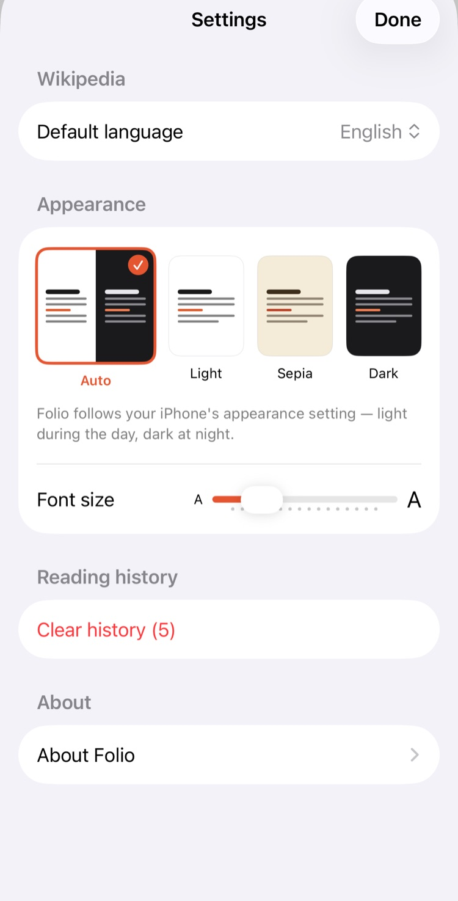

# Folio

V for Wikipedia by Frank Rausch was the nicest way to
read Wikipedia on a phone. It was discontinued and pulled from the App Store
in August 2022. I kept using my copy anyway, until Wikipedia changed
something in their APIs and the Today view went blank. So I built Folio: a
personal recreation of the parts I used every day. It is an homage, not a replacement. The original's polish took years. This took a few evenings, and it shows in places.

<p align="center">
  
  
  
  
</p>

## What it does

- Today: Wikipedia's featured article, most-read, and news as a photo grid
- Reader: EB Garamond, generous leading, hero images with face-aware cropping
  (Vision, on-device), light/sepia/dark themes, pinch to change text size,
  table of contents, image gallery
- Nearby: Wikipedia articles around you, on a map
- Search, bookmarks, and reading history, stored locally with SwiftData
- English and German Wikipedia, toggled from the header
- Articles and images are cached and prefetched, so most things open instantly

There is no backend, no analytics, and no accounts. The app talks directly to
Wikipedia's public APIs and nothing else. Nearby sends your coordinates to
Wikipedia's geosearch endpoint and nowhere further.

## Building

You need Xcode 16 or newer and [XcodeGen](https://github.com/yonaskolb/XcodeGen):

```
cd Folio
xcodegen generate
open Folio.xcodeproj
```

Change the development team to your own, then build and run. Targets iOS 18,
iPhone first. Sideloads fine with a free Apple ID. That is how I run it.

If you plan to commit, enable the repo's hooks once with
`git config core.hooksPath .githooks`. They run [gitleaks](https://github.com/gitleaks/gitleaks)
over staged changes, commit messages, and outgoing pushes.

## Status

Alpha. I use it daily and fix whatever annoys me, roughly in that order.
Known gaps: no tests, only English and German Wikipedia, iPad launches but
has had no attention, and offline reading covers only what you have already
opened. Issues and pull requests are welcome. I can't promise a roadmap.

## Credits

- V for Wikipedia by Frank Rausch (Raureif) is the
  design Folio chases. Folio is not affiliated with Raureif.
- [Typographizer](https://github.com/frankrausch/Typographizer) by Frank
  Rausch, vendored under its MIT license.
- All content comes from [Wikipedia](https://www.wikipedia.org) via the
  Wikimedia APIs and is licensed CC BY-SA. Folio is not affiliated with the
  Wikimedia Foundation.

[MIT](LICENSE)
